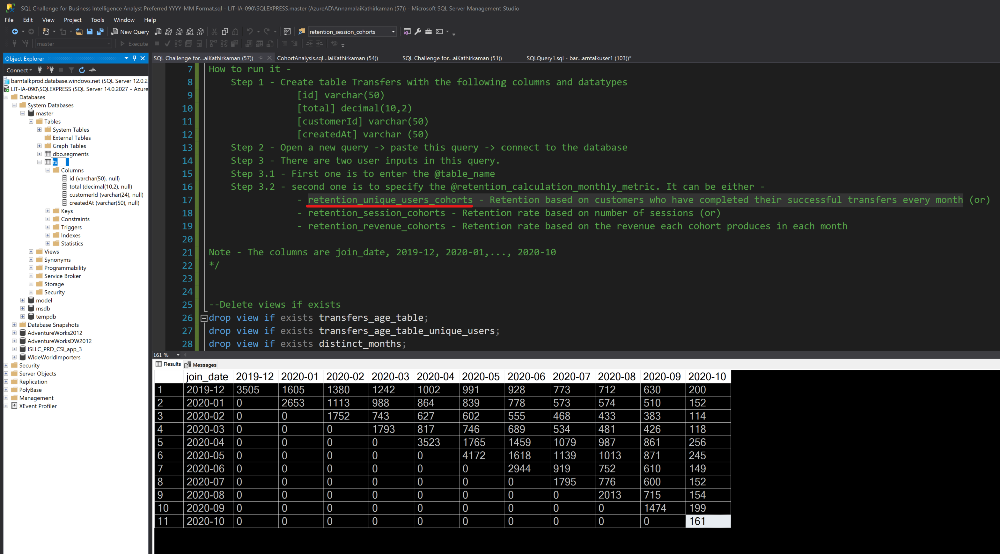
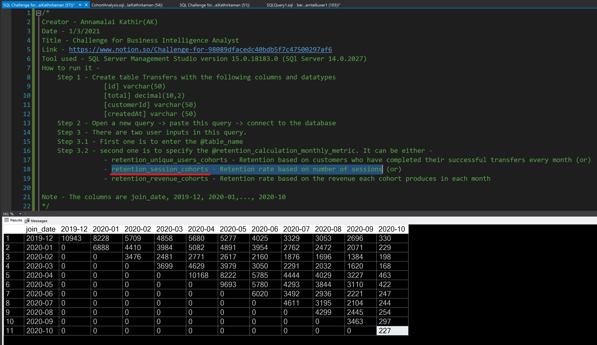
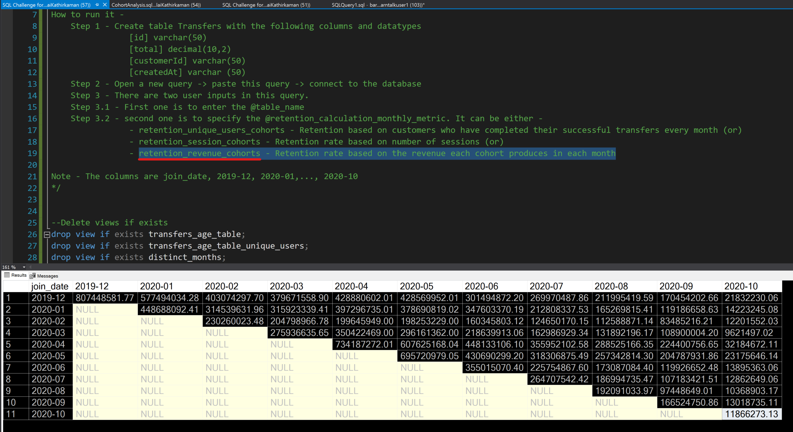

# Challenge for Business Intelligence Analyst
* Date - 1/5/2020
* Link - https://www.notion.so/Challenge-for-98089dfacedc40bdb5f7c47500297af6

## Table of Contents
* [General info](#general-info)
* [Instructions](#Instructions)
* [Queries with output](#Queries_with_output)

## General info
* Author - Annamalai Kathir
* SQL Version - SQl Server 14.0.2027

## Instructions
### Before getting started, I would like to talk about the two folders in this location
* [Query_output_in_preferred_column_format_YYYY-MM](Query_output_in_preferred_column_format_YYYY-MM)
	* This is what you asked in the challange
* [Query_output_with_column_in_month_number_format](Query_output_with_column_in_month_number_format)
	* This is something I did out of curiosity. This query outputs both cohort and cohort percentage tables.

### Steps
* Step 0 - Open SQL Server Management Studio
* Step 1 - Create table Transfers (or import tables) with the following columns and datatypes
```
[id] varchar(50)
[total] decimal(10,2)
[customerId] varchar(50)
[createdAt] varchar (50)
```
* Step 2 - Open a new query tab -> Copy sql query from [here](./Query_output_in_preferred_column_format_YYYY-MM/SQL%20Challenge%20for%20Business%20Intelligence%20Analyst%20Preferred%20with%20YYYY-MM%20Column%20Format.sql) -> paste and connect to the database where the table resides
* Step 3 - There are two user inputs in this query.
	* Step 3.1 - First one is to enter the `@table_name` (search (ctrl/cmd + F) for it if you cannot find it)
	* Step 3.2 - Second one is to specify the `@retention_calculation_monthly_metric` (search (ctrl/cmd + F) for it if you cannot find it). It can be either -
		* **retention_unique_users_cohorts** - Retention based on customers who have completed their successful transfers every month
		* **retention_session_cohorts** - Retention rate based on number of sessions (or) 
		* **retention_revenue_cohorts** - Retention rate based on the revenue each cohort produces in each month
* Step 4 - Execute the query!

## Queries_with_output
[Query_output_in_preferred_column_format_YYYY-MM](Query_output_in_preferred_column_format_YYYY-MM)
### retention_unique_users_cohorts
```
  select *
  from 
	(select customerid, join_date, cdate
	from transfers_age_table_unique_users) t1
  pivot
	(count(customerid)
	for cdate
	in (' + @months_list + ')
	) as cohorts;	
```


### retention_session_cohorts
```
  select *
  from 
	(select customerid, join_date, cdate
	from transfers_age_table) t1
  pivot
	(count(customerid)
	for cdate
	in (' + @months_list + ')
	) as cohorts;
```


### retention_revenue_cohorts
```
  select *
  from 
	(select total, join_date, cdate
	from transfers_age_table) t1
  pivot
	(sum(total)
	for cdate
	in (' + @months_list + ')
	) as cohorts;		
```


3. It is absolutely imperative that you specify what version of SQL you are using (My SQL, SQL Server, etc...). Also, please include a final output (either a JPG or a link to a dashbaord) of what the SQL executes to (as seen in the picture above).

4. Please comment your SQL code when needed and provide instructions of how to execute the SQL script.
